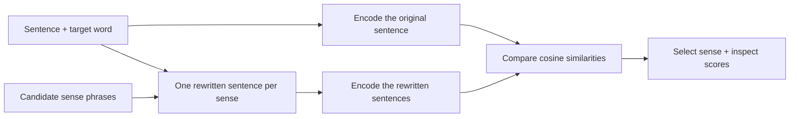

# UWSD: Unsupervised Word Sense Disambiguation

**Resolve lexical ambiguity by measuring how well a candidate sense preserves sentence meaning.**

[](https://doi.org/10.1007/s10489-026-07492-8)
[](pyproject.toml)
[](LICENSE)
[](#citation)

[Published paper](https://doi.org/10.1007/s10489-026-07492-8) · [Preprint](https://arxiv.org/abs/2305.03520) · [Quickstart](#quickstart) · [Results](#benchmark-results) · [Python API](#python-api) · [Reproducibility](#reproducible-experiments) · [Citation](#citation)

UWSD is the research code and evaluation toolkit accompanying **[Context-aware semantic similarity measurement for unsupervised word sense disambiguation](https://doi.org/10.1007/s10489-026-07492-8)** by Jorge Martinez-Gil, published in **Applied Intelligence, volume 56, article 438 (2026)**. It selects among candidate word senses using context-aware semantic similarity, without fitting a disambiguation model on sense-annotated training examples.

**Research result:** the [2023 preprint](https://arxiv.org/pdf/2305.03520v4) reports **77.74% accuracy** for UWSD+BERT on **10,196 CoarseWSD-20 test instances**, compared with **73.43%** for the most-frequent-sense baseline—a difference of **4.31 percentage points**. See [results and provenance](#benchmark-results) for the distinction between those experiments and the current benchmark harness.

If you build on the method, code, or evaluation toolkit, please [cite the paper](#citation). The repository also provides machine-readable [citation metadata](CITATION.cff).

## Why use UWSD in your research?

- **Establish a baseline without WSD training labels.** Compare a substitution-based approach with your own system using the same test split and sense inventory.
- **Study sentence encoders and sense descriptions.** Change the Sentence-Transformers model or candidate phrases to investigate what drives disambiguation quality.
- **Inspect individual decisions.** Examine candidate similarity scores, the winning margin, and substitution-based explanations alongside per-word metrics.
- **Produce traceable comparisons.** Export JSON results, Markdown and LaTeX tables, bootstrap accuracy intervals, and paired significance tests.
- **Start with a small experiment.** Run the bundled data with NumPy-only baselines, then add neural encoders when needed.

The repository contains the original experiment scripts and a newer installable Python package. The [repository guide](#repository-guide) identifies each.

## How the method works

For a sentence containing an ambiguous word, UWSD substitutes each candidate sense phrase into the sentence, encodes the original and rewritten sentences, and selects the candidate with the highest cosine similarity to the original.



For example, candidate substitutions for `java` in `i wrote the backend in java .` could use `programming language` or `javanese island`. The encoder scores how closely each rewritten sentence preserves the original meaning; the example's prediction depends on the chosen encoder.


Here, **unsupervised** means that the substitution method does not learn from the benchmark's sense labels. It still needs a supplied sense inventory and a pretrained encoder; the encoder may itself have used supervised pretraining or fine-tuning. Test labels are used for evaluation. The MFS reference baseline uses training labels.

## Quickstart

Use **Python 3.9 or later** in an isolated environment compatible with your chosen backend. Run the following from the repository checkout:

```bash
git clone https://github.com/jorge-martinez-gil/uwsd.git
cd uwsd
python -m pip install -e .

uwsd list-methods
uwsd run --method mfs --output results/my-mfs.json --keep-correct
```

The core package depends on NumPy. The dataset is included in the checkout, so the MFS, random, and hashing methods need no model or dataset downloads after installation. The full MFS run should yield **7,487 / 10,196 correct predictions (73.43%)**.

If the `uwsd` executable is not on your path, use `python -m uwsd` in its place. Commands below use single lines so they can be copied into Bash or PowerShell.

### Run a neural encoder

```bash
python -m pip install -e ".[bert]"

# Smoke test: first 20 test examples for one word
uwsd run --method bert --model all-MiniLM-L6-v2 --words java --limit 20 --output results/my-java-smoke.json --keep-predictions

# Full benchmark: all 20 words and 10,196 test examples
uwsd run --method bert --model all-MiniLM-L6-v2 --output results/my-minilm.json --keep-correct --keep-predictions
```

The first neural run downloads the selected model unless it is already cached. `--limit` applies **per word**; omit both `--words` and `--limit` for a full benchmark. A new run with the current package is a new experiment, not an automatic reproduction of the paper's best result.

### Disambiguate a sentence

```bash
uwsd predict --method bert --model all-MiniLM-L6-v2 --sentence "i wrote the backend in java ." --target java --senses "island=javanese island" "code=programming language"
```

The CLI prints the chosen sense and an explanation containing cosine scores and the winning margin. For a model-free pipeline check, replace `--method bert` with `--method hashing` and omit `--model`.

Targets are matched against whitespace-separated tokens. Supply an exact token with `--target`, or a zero-based position with `--target-index`. The displayed confidence is a temperature-scaled score, **not a calibrated probability of correctness**. See [scope and limitations](#scope-and-limitations) for substitution behavior.

### Available methods

| CLI method | Implementation | Uses WSD training labels? | Installation |
| --- | --- | --- | --- |
| `mfs` | Most frequent sense in the training split | Yes | Core |
| `random` | Uniform random sense; default seed `42` | No | Core |
| `hashing` | Substitution similarity with character n-gram hashing | No | Core |
| `bert` | Substitution similarity; default `all-MiniLM-L6-v2` | No | `.[bert]` |
| `sbert` | Substitution similarity; default `all-mpnet-base-v2` | No | `.[bert]` |
| `similarity` | Generic substitution method; configurable encoder through the Python API | No | Backend-dependent |

`bert` and `sbert` are registry aliases for the same substitution implementation with different default models. In result manifests, both appear as `similarity`; the `encoder` field identifies the actual model. Hashing is intended for tests and offline demonstrations.

The ELMo, USE, and WMD implementations are available as [legacy scripts](#repository-guide), rather than registered CLI methods. Installing optional dependencies does not add those methods to the registry.

## Benchmark results

### Results reported in the preprint

The following accuracies are transcribed from **Table 1 of [arXiv:2305.03520v4](https://arxiv.org/pdf/2305.03520v4)**, which summarizes the best results for each embedding approach on CoarseWSD-20.

| Strategy | Reported accuracy |
| --- | ---: |
| **UWSD + BERT** | **77.74%** |
| MFS baseline | 73.43% |
| UWSD + USE | 71.94% |
| UWSD + ELMo | 68.75% |
| UWSD + WMD | 60.00% |
| Random-option baseline | 43.73% |

These are historical results from the 2023 preprint, not measurements from the current package or a separate verification of the final journal article's results. The repository does not include neural-run manifests establishing their reproduction with the new harness. The preprint's random-option reference also differs from a particular seeded random run.

### Results backed by repository manifests

These results come directly from the linked JSON artifacts for the full bundled test split. Each file records the package version, environment, and commit associated with its run.

| Method | Correct / total | Accuracy | 95% bootstrap CI | Artifact |
| --- | ---: | ---: | ---: | --- |
| MFS (uses training labels) | 7,487 / 10,196 | 73.43% | [72.57%, 74.25%] | [mfs.json](results/mfs.json) |
| Hashing (offline demonstration) | 5,612 / 10,196 | 55.04% | [54.11%, 56.00%] | [hashing.json](results/hashing.json) |
| Random (seed `42`) | 4,506 / 10,196 | 44.19% | [43.26%, 45.18%] | [random.json](results/random.json) |

Generate a table from those artifacts, including F1 metrics:

```bash
uwsd report results/mfs.json results/random.json results/hashing.json --format markdown
```

MFS matches the preprint's aggregate baseline count. That check validates a useful reference point; it does not establish equivalence between the legacy neural scripts and the current implementation.

## Reproducible experiments

After the full runs in the quickstart, generate tables and compare their paired predictions:

```bash
uwsd report results/my-mfs.json results/my-minilm.json --format markdown --output results/my-summary.md
uwsd report results/my-mfs.json results/my-minilm.json --format latex --caption "CoarseWSD-20 test results." --output results/my-summary.tex
uwsd compare results/my-minilm.json results/my-mfs.json
```

The LaTeX output uses `booktabs`. Both inputs to `compare` must be generated with `--keep-correct` and cover **the same instances in the same order**. Use identical dataset files, word selections, and limits: the command checks vector lengths but does not verify instance identities. The checked-in baseline manifests omit correctness vectors, so rerun them before using `compare`.

### What a run records

| Output | Contents |
| --- | --- |
| `--output PATH` | JSON manifest with method metadata, encoder where applicable, selected words, instance count, per-word limit, metrics, and UTC timestamp |
| Environment metadata | UWSD and Python versions, platform, selected installed package versions, and Git commit when available |
| `--keep-predictions` | Per-instance IDs, sentences, gold labels, predictions, candidate scores, confidence values, low-confidence flags, and explanations |
| `--keep-correct` | Per-instance correctness vector used by paired comparison tests |

A JSON file is saved only when `--output` is supplied. Run from the UWSD checkout so the recorded Git commit refers to this repository.

### Metrics and reporting protocol

- **Micro-accuracy:** total correct predictions divided by total evaluated instances.
- **Macro-F1 over words:** the unweighted mean of each word's macro-F1 over labels present in the gold or predicted data.
- **Weighted-F1 over words:** the instance-count-weighted mean of each word's support-weighted F1.
- **Accuracy interval:** a percentile bootstrap over individual test instances, using 2,000 resamples and seed `1234` by default.
- **Paired comparison:** accuracy difference with a bootstrap interval and p-value, plus an exact McNemar test. The paired bootstrap defaults to 10,000 resamples and seed `1234`.

For a research artifact, retain the command, JSON manifests, exact dataset and sense mappings, encoder revision, dependency versions, hardware details, and random seeds. Record any custom scoring parameters separately: the manifest is not a complete environment lockfile and does not capture hardware, model revisions, dataset checksums, or every method parameter. The instance-level interval measures test-sample variability, not variation across model seeds or domains.

## Python API

Run an offline evaluation and save a manifest:

```python
import json
from pathlib import Path

from uwsd import get_method, load_coarsewsd20
from uwsd.evaluate import evaluate
from uwsd.report import per_word_markdown

dataset = load_coarsewsd20(words=["bank", "java"])
method = get_method("hashing")
manifest = evaluate(method, dataset, limit=20, keep_predictions=True)

print(f"Accuracy: {manifest['metrics']['micro_accuracy']:.2%}")
print(per_word_markdown(manifest))

output = Path("results/my-api-run.json")
output.parent.mkdir(parents=True, exist_ok=True)
output.write_text(json.dumps(manifest, indent=2), encoding="utf-8")
```

For a neural experiment, use `get_method("bert", model="all-MiniLM-L6-v2")` after installing `.[bert]`. Remove the word selection and evaluation limit for the full benchmark. The Python `evaluate()` function returns a correctness vector by default; the CLI retains it only with `--keep-correct`.

### Extend the evaluation

Any sentence encoder exposing `name` and `encode(texts)` can be used with `SubstitutionSimilarity`. Return an array of shape `(number_of_texts, embedding_dimension)` with L2-normalized rows, because the scorer uses dot products as cosine similarities.

This runnable example registers an alternative hashing configuration:

```python
from uwsd import get_method, load_coarsewsd20
from uwsd.evaluate import evaluate
from uwsd.methods import register_method
from uwsd.methods.similarity import HashingEncoder, SubstitutionSimilarity

register_method(
    "hashing-1024",
    lambda **kwargs: SubstitutionSimilarity(
        encoder=HashingEncoder(dim=1024), **kwargs
    ),
    description="Substitution similarity with a 1024-dimensional hashing encoder.",
)

manifest = evaluate(
    get_method("hashing-1024"), load_coarsewsd20(words=["java"]), limit=20
)
print(manifest["metrics"]["micro_accuracy"])
```

For a different WSD algorithm, subclass [`WSDMethod`](uwsd/methods/base.py), implement `predict(instance, task)`, and return a `Prediction`. Methods using training data should set `requires_train = True` and implement `fit(task)`. Registration takes effect only in the Python process that imports the registration code; a separate CLI invocation must import your module before looking up the method.

## Dataset

The bundled [`CoarseWSD-20/`](CoarseWSD-20) directory contains **20 ambiguous English nouns and 10,196 test instances**. The benchmark originates from Wikipedia and uses coarse-grained senses; credit belongs to [Loureiro et al. (2021)](https://aclanthology.org/2021.cl-2.14/) and the [upstream dataset repository](https://github.com/danlou/bert-disambiguation).

Included words: `apple`, `arm`, `bank`, `bass`, `bow`, `chair`, `club`, `crane`, `deck`, `digit`, `hood`, `java`, `mole`, `pitcher`, `pound`, `seal`, `spring`, `square`, `trunk`, and `yard`.

Sense phrases are derived from `classes_map.txt` by replacing underscores, removing parentheses, and dropping tokens equal to the target word. Treat these mappings as part of the experimental configuration: changes to phrase wording can affect predictions.

For another dataset in the same layout, supply its root explicitly:

```bash
uwsd run --method mfs --data-root /path/to/CoarseWSD-20 --output results/my-dataset.json
```

Each word directory should contain:

```text
CoarseWSD-20/<word>/
  classes_map.txt    # JSON object: string label IDs mapped to sense descriptions
  train.data.txt     # Zero-based token index, tab, whitespace-tokenized sentence
  train.gold.txt     # One integer label ID per line
  test.data.txt      # Same format as train.data.txt
  test.gold.txt      # Gold labels aligned with test.data.txt
```

`UWSD_DATA` is also supported for dataset discovery. Keep gold labels aligned with the data rows and preserve the sense inventory when comparing systems.

## Scope and limitations

- **Evaluation scope.** The reported results concern English coarse-grained noun disambiguation on CoarseWSD-20. Other languages, fine-grained senses, and domain shifts need separate evaluation.
- **Inventory dependence.** The correct sense must be present among the candidates. Description quality, encoder choice, and input length can influence the scores.
- **Substitution behavior.** The current implementation uses literal string replacement, which can replace every matching occurrence, including matches inside longer words. A target index identifies the target token but does not restrict replacement to that occurrence.
- **Interpretation.** Explanations describe the scoring decision. Softmax confidence and low-margin flags are diagnostic signals, not calibrated uncertainty estimates or proof of linguistic correctness.
- **Reproduction scope.** The current harness adds evaluation features and may differ from the original scripts in preprocessing and dependencies. Match the original configuration before claiming to reproduce a paper result.

## Citation

Please cite the published journal article when using the UWSD method, implementation, or benchmark toolkit in your research:

**Jorge Martinez-Gil. 2026. _Context-aware semantic similarity measurement for unsupervised word sense disambiguation._ Applied Intelligence, 56(15), article 438. [doi:10.1007/s10489-026-07492-8](https://doi.org/10.1007/s10489-026-07492-8).**

```bibtex
@article{MartinezGil2026,
  author  = {Martinez-Gil, Jorge},
  title   = {Context-aware semantic similarity measurement for unsupervised word sense disambiguation},
  journal = {Applied Intelligence},
  year    = {2026},
  volume  = {56},
  number  = {15},
  pages   = {438},
  doi     = {10.1007/s10489-026-07492-8},
  url     = {https://doi.org/10.1007/s10489-026-07492-8},
  issn    = {1573-7497}
}
```

For software provenance, include the repository URL and the commit or release used in your experiments. [CITATION.cff](CITATION.cff) provides the preferred citation in machine-readable form.

If you use CoarseWSD-20, **also cite its authors**:

```bibtex
@article{loureiro2021analysis,
  author  = {Loureiro, Daniel and Rezaee, Kiamehr and Pilehvar, Mohammad Taher and Camacho-Collados, Jose},
  title   = {Analysis and Evaluation of Language Models for Word Sense Disambiguation},
  journal = {Computational Linguistics},
  volume  = {47},
  number  = {2},
  pages   = {387--443},
  year    = {2021},
  doi     = {10.1162/coli_a_00405},
  url     = {https://aclanthology.org/2021.cl-2.14/}
}
```

## Repository guide

| Path | Purpose |
| --- | --- |
| [`uwsd/`](uwsd) | Installable package: data loading, methods, evaluation, CLI, and reporting |
| [`CoarseWSD-20/`](CoarseWSD-20) | Bundled benchmark data and sense mappings |
| [`results/`](results) | Saved baseline manifests backing the table above |
| [`tests/`](tests) | Dataset, metric, and method checks |
| [`uwsd-bert.py`](uwsd-bert.py), [`uwsd-bert-cuda.py`](uwsd-bert-cuda.py) | Original transformer experiments |
| [`uwsd-elmo.py`](uwsd-elmo.py), [`uwsd-elmo-cuda.py`](uwsd-elmo-cuda.py), [`uwsd-use.py`](uwsd-use.py), [`uwsd-wmd.py`](uwsd-wmd.py) | Legacy ELMo, USE, and WMD experiments |
| [`cass-wordnet+bert.py`](cass-wordnet+bert.py), [`cass-word2vec+bert.py`](cass-word2vec+bert.py), [`cass-webscrapping+bert.py`](cass-webscrapping+bert.py) | Context-aware similarity experiments with alternative candidate sources |
| [`pyproject.toml`](pyproject.toml) | Current package dependencies and optional extras |
| [`requirements.txt`](requirements.txt) | Legacy experiment dependency pins |

Start new experiments with the package. Legacy scripts may require their original dependencies, model assets, and path adjustments; the core installation does not provision every legacy experiment.

## Contributing and support

Contributions of encoders, WSD methods, dataset loaders, error analyses, and reproducible results are welcome. See [CONTRIBUTING.md](CONTRIBUTING.md) for the workflow. Include a result manifest and experimental configuration with new benchmark claims.

```bash
python -m pip install -e ".[dev]"
python -m pytest
```

Use [GitHub Issues](https://github.com/jorge-martinez-gil/uwsd/issues) for bugs and research questions. For a reproduction issue, include the command, commit, model identifier, environment, and relevant manifest.

## License and acknowledgments

The UWSD code is released under the [MIT License](LICENSE). Dataset and pretrained-model attribution and terms should be checked with their respective sources. Thanks to the CoarseWSD-20 authors and the embedding-library maintainers whose work supports these experiments.
