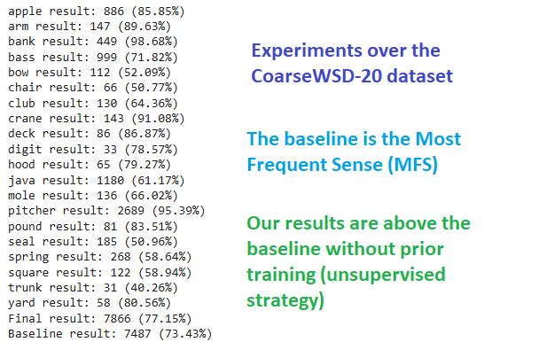
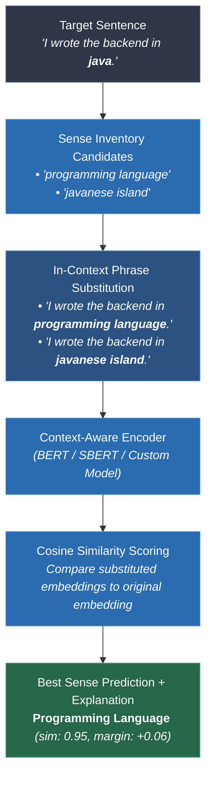

<div align="center">

# 🔠 UWSD: Unsupervised Word Sense Disambiguation

**A reproducible benchmark & experimentation platform for unsupervised word sense disambiguation via context-aware semantic similarity.**

[](https://arxiv.org/abs/2305.03520)
[](https://www.python.org/)
[](https://opensource.org/licenses/MIT)
[](https://github.com/danlou/bert-disambiguation)
[](https://scholar.google.com/citations?view_op=view_citation&hl=en&citation_for_view=X1pRUYcAAAAJ:7XUxBq3GufIC)

[Paper](https://arxiv.org/abs/2305.03520) • [Medium Article](https://medium.com/@jorgemarcc/applications-of-context-aware-semantic-similarity-9c62492be392) • [Quickstart](#-quickstart-cli) • [Python API](#-python-api) • [Citation](#-citation)

<br/>



</div>

---

## 🌟 Overview

Many words carry multiple meanings. For instance, **"Java"** can refer to a programming language or an island; **"bank"** can mean a financial institution or a river bank. **Word Sense Disambiguation (WSD)** is the NLP task of identifying which sense of an ambiguous word is intended in a given context.

**UWSD** accompanies the paper *"Context-Aware Semantic Similarity Measurement for Unsupervised Word Sense Disambiguation"* ([arXiv:2305.03520](https://arxiv.org/abs/2305.03520)). It provides an **installable Python package and single-command benchmark CLI** for evaluating unsupervised WSD methods, custom transformer encoders, and similarity measures under standardized, reproducible conditions.

---

## ✨ Key Features

| Feature | Description |
| :--- | :--- |
| ⚡ **Zero-Shot & Unsupervised** | No sense-labelled training data required. Disambiguates words using sentence embeddings & substitution similarity. |
| 📊 **Standardized Harness** | Built-in loader for **CoarseWSD-20**, paired 95% bootstrap confidence intervals, and McNemar statistical significance testing. |
| 🧪 **Reproducible Manifests** | Every run automatically generates a JSON manifest with exact metrics, git commit, system metadata, and hardware config. |
| 🎯 **Interpretable Predictions** | Generates human-readable explanations, candidate similarity margins, and low-confidence flags for every prediction. |
| 🔌 **Pluggable Architecture** | Benchmark your own Hugging Face model or custom WSD algorithm in less than 10 lines of code. |
| 🛠️ **CLI & Python API** | Seamless CLI commands (`uwsd run`, `report`, `compare`, `predict`) and clean Python developer API. |

---

## 🧠 How It Works

UWSD disambiguates target words by **substituting each candidate sense phrase into the target sentence** and measuring how well sentence meaning is preserved via context-aware sentence embeddings:



### ⚖️ Supervised vs. Unsupervised WSD

| Dimension | Supervised WSD | **UWSD (Unsupervised)** |
| :--- | :--- | :--- |
| **Sense-Annotated Labels** | Required (expensive, language-specific) | **None required** |
| **Domain Adaptation** | Requires full model retraining | Swap encoder or sense inventory |
| **Knowledge Source** | Human-labelled corpora | Pretrained language models / Embeddings |
| **Interpretability** | Black-box classifier probabilities | Explicit substitution similarity margins |

---

## 📦 Installation

UWSD requires **Python ≥ 3.9**. Clone the repository and install with optional extras based on your workflow:

```bash
# Clone the repository
git clone https://github.com/jorge-martinez-gil/uwsd
cd uwsd

# Core installation (numpy-only, lightweight baseline support)
pip install -e .

# Recommended: + Sentence-Transformers for BERT & SBERT methods
pip install -e ".[bert]"

# Full installation: + Gensim (WMD) and TensorFlow Hub (USE)
pip install -e ".[all]"
```

> [!NOTE]
> The **CoarseWSD-20** dataset is bundled directly inside the repository, so no additional downloads are needed to start benchmarking right away!

---

## 🚀 Quickstart (CLI)

UWSD includes a single CLI binary (`uwsd`) with intuitive commands for benchmarking and single-sentence prediction:

```bash
# 1. List all available WSD methods & baselines
uwsd list-methods

# 2. Run the Most-Frequent-Sense (MFS) baseline on CoarseWSD-20
uwsd run --method mfs --output results/mfs.json

# 3. Run context-aware similarity with a Sentence-Transformer model
uwsd run --method bert --model all-MiniLM-L6-v2 --output results/bert.json

# 4. Generate publication-ready summary tables (Markdown or LaTeX)
uwsd report results/*.json --format markdown
uwsd report results/*.json --format latex --caption "Unsupervised WSD on CoarseWSD-20."

# 5. Compute statistical significance between two models (Paired Bootstrap + McNemar test)
uwsd run --method mfs  --output results/mfs.json  --keep-correct
uwsd run --method bert --output results/bert.json --keep-correct
uwsd compare results/bert.json results/mfs.json

# 6. Disambiguate a single sentence interactively with a full explanation
uwsd predict --method bert \
  --sentence "i wrote the backend in java ." --target java \
  --senses "isl=javanese island" "prog=programming language"
```

> [!TIP]
> Every `uwsd run` command automatically outputs a **reproducibility manifest** (`--output`) capturing metrics, 95% bootstrap confidence intervals, python environment details, git commit hash, and hardware properties.

---

## 📊 Benchmark Results

### Published Paper Results (CoarseWSD-20, 10,196 Test Instances)

| Strategy | Hits | Accuracy |
| :--- | :---: | :---: |
| 🥇 **UWSD + BERT** | **7,927** | **77.74%** |
| 🥈 **MFS Baseline** *(supervised reference)* | 7,487 | 73.43% |
| 🥉 **UWSD + USE** | 7,335 | 71.94% |
| 🔹 **UWSD + ELMo** | 7,010 | 68.75% |
| 🔹 **UWSD + WMD** | 5,868 | 57.55% |
| 🔸 **Random Baseline** | 4,459 | 43.73% |

### Harness Verified Reproductions (with 95% Bootstrap CIs)

| Method | Hits / Total | Accuracy | 95% Bootstrap CI | Reproducibility Manifest |
| :--- | :---: | :---: | :---: | :---: |
| **MFS Baseline** *(uses labels)* | 7,487 / 10,196 | 73.43% | [72.57%, 74.25%] | Exact match with paper |
| **Random** *(seeded)* | 4,506 / 10,196 | 44.19% | [43.26%, 45.18%] | Verified harness baseline |

```bash
# Verify the paper's exact MFS baseline number (7,487 hits / 73.43%):
uwsd run --method mfs
```

---

## 🐍 Python API

Incorporate UWSD directly into your Python experiments or evaluation scripts:

```python
from uwsd import load_coarsewsd20, get_method
from uwsd.evaluate import evaluate

# 1. Load the bundled CoarseWSD-20 dataset
dataset = load_coarsewsd20()

# 2. Instantiate a context-aware transformer method
method = get_method("bert", model="all-MiniLM-L6-v2")

# 3. Run evaluation & generate metrics with confidence intervals
manifest = evaluate(method, dataset, keep_predictions=True)

# 4. Access micro-accuracy & 95% confidence intervals
print(f"Accuracy: {manifest['metrics']['micro_accuracy']:.2%}")
print(f"95% CI:   {manifest['metrics']['accuracy_ci95']}")
```

---

## 🛠️ Evaluate Your Own WSD Algorithm

You can register a custom WSD method in just a few lines of code:

```python
from uwsd.methods import register_method, WSDMethod, Prediction

@register_method("my-method", description="Custom contextual similarity method.")
class MyCustomWSD(WSDMethod):
    def predict(self, instance, task):
        # Compute custom sense similarity scores
        scores = {label_id: my_score_fn(instance, task, label_id) for label_id in task.label_ids}
        best_id = max(scores, key=scores.get)
        
        return Prediction(
            label_id=best_id,
            label=task.classes[best_id],
            scores=scores,
            confidence=scores[best_id],
            explanation=f"Selected {task.classes[best_id]} based on custom score."
        )
```

Once defined, your method is automatically recognized by `uwsd run --method my-method`!

---

## 🔍 Interpretability & Explanations

Every prediction produced by UWSD is fully interpretable. It details candidate similarity scores, confidence margin, and explicit reasoning:

```text
Predicted: programming language (confidence: 95.0%)
Why: Replacing 'java' with sense phrase 'programming language' best preserved sentence meaning 
     (cosine=0.95, margin=0.06). 
Candidates:
  • 'programming language' -> cosine sim = 0.95
  • 'javanese island'      -> cosine sim = 0.89
```

---

## 📁 Dataset Details

UWSD evaluates on **[CoarseWSD-20](https://github.com/danlou/bert-disambiguation)** (Loureiro et al., 2021), a benchmark targeting 20 coarse-grained ambiguous nouns (e.g., *apple*, *bank*, *crane*, *java*, *python*, *mole*) spanning 10,196 test instances.

To use custom datasets formatted like CoarseWSD-20, simply set the environment variable:
```bash
export UWSD_DATA="/path/to/custom/dataset"
```

---

## 📚 Citation

If you use this codebase, benchmark harness, or context-aware similarity approach in your research, please cite our paper:

```bibtex
@article{MartinezGil2026,
  author  = {Martinez-Gil, Jorge},
  title   = {Context-aware semantic similarity measurement for unsupervised word sense disambiguation},
  journal = {Applied Intelligence},
  year    = {2026},
  volume  = {56},
  number  = {15},
  pages   = {438},
  doi     = {10.1007/s10489-026-07492-8},
  url     = {https://doi.org/10.1007/s10489-026-07492-8},
  issn    = {1573-7497}
}
```

A machine-readable [`CITATION.cff`](CITATION.cff) file is also provided in this repository.

### 📖 Research Citing This Work

1. **[Pantip Multi-turn Datasets Generating from Thai Large Social Platform Forum Using Sentence Similarity Techniques](https://ieeexplore.ieee.org/iel8/10799229/10799211/10799403.pdf)**  
   *A. Sae-Oueng, K. Kerdthaisong, et al.* — IEEE Joint Symposium, 2024.
2. **[Assessing GPT's Potential for Word Sense Disambiguation: A Quantitative Evaluation on Prompt Engineering Techniques](https://doi.org/10.1109/icsgrc62081.2024.10691283)**  
   *D. Sumanathilaka, N. Micallef, J. Hough* — IEEE ICSGRC, 2024.
3. **[GlossGPT: GPT for Word Sense Disambiguation using Few-shot Chain-of-Thought Prompting](https://www.sciencedirect.com/science/article/pii/S1877050925008385)**  
   *D. Sumanathilaka, N. Micallef, J. Hough* — Elsevier Procedia Computer Science, 2025.

---

## 🤝 Contributing

Contributions of new WSD algorithms, transformer backends, dataset loaders, or evaluation metrics are welcome!  
Please see [CONTRIBUTING.md](CONTRIBUTING.md) for details on code style and testing.

```bash
# Run unit tests
python -m pytest
```

---

## 📄 License

This project is licensed under the **MIT License** - see the [LICENSE](LICENSE) file for details.
